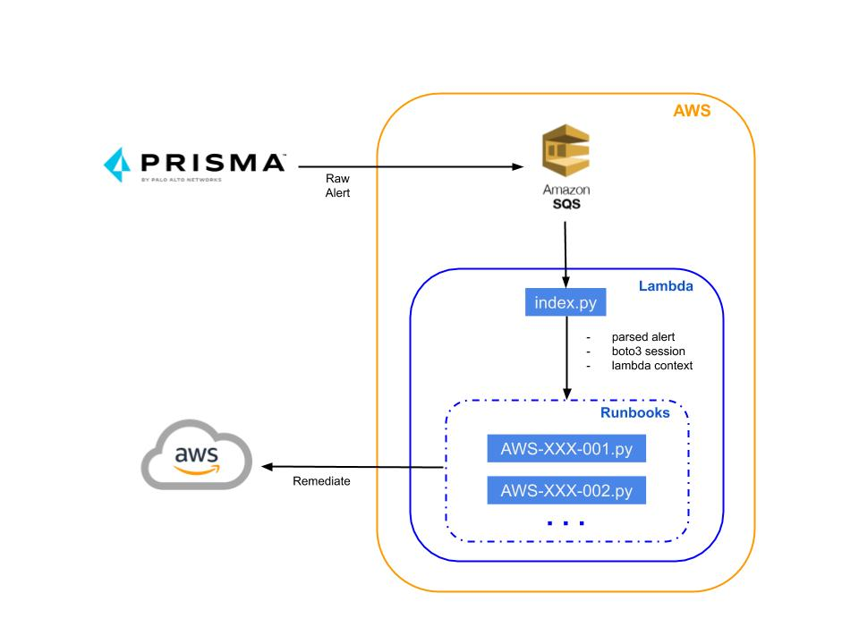

# Prisma Cloud AWS Remediation



## Setup

Please see the [Setup Guide](docs/setup.md).

## How it works

The Prisma Cloud platform sends alert messages to an AWS SQS Queue. SQS invokes a lambda function (`index_prisma.py`). The function then calls the appropriate runbook script to remediate the alert(s).

The `lambda_package` consists of two main components: `index_prisma.py` and the `runbooks` folder.

### `index_prisma.py`

This is the lambda function handler. It does the following:

- Parse/simplify the raw alert message.
- Generate boto3 session based on the account ID and region. If the resource is located in another AWS account, lambda function will do `sts.assumeRole` and build the session to handle the remediation.
- Trigger corresponding runbook.

The `parsed_alert` message has the following structure:

```text
- resource_id           : AWS resource ID.
- alert_id              : Prisma Cloud alert ID.
- account
    + name              : Account name.
    + account_number    : AWS account number ID.
- region                : AWS region code. (Example: us-east-1)
- runbook_id            : Converted Prisma Cloud policy ID to runbook ID. (Example: AWS-EC2-001)
- metadata              : Alert metadata object.
```

### Runbooks

All remediation scripts/runbooks will be in this folder. Each runbook corresponds to a particular policy ID.

The runbook itself looks like:

```python
"""
Remediate Prisma Cloud Policy:

AWS:SVC-000 Policy Title

Description:

Remediation description..

Required Permissions:

- ec2:Describe..
- ec2:Modify..

Sample IAM Policy:

{
  "Version": "2012-10-17",
  "Statement": [
    {
      "Sid": "EC2Permissions",
      "Action": [
        "ec2:Describe..,"
        "ec2:Modify.."
      ],
      "Effect": "Allow",
      "Resource": "*"
    }
  ]
}
"""

import boto3
from botocore.exceptions import ClientError


def remediate(session, alert, lambda_context):
  """
  Main Function invoked by index_prisma.py
  """

  # Data from the alert
  resource_id = alert['resource_id']
  region = alert['region']

  # Create EC2 client session
  ec2 = session.client('ec2', region_name=region)

  # Remediation check
  try:
    response = ec2.describe..
  except ClientError as e:
    print(e.response['Error']['Message'])
    return

  # Remediate
  if response == None:
    result = ec2_fix_it(ec2, resource_id)

  return


def ec2_fix_it(ec2, resource_id):
  """
  EC2 Fix it!
  """

  try:
    result = ec2.modify..
  except ClientError as e:
    print(e.response['Error']['Message'])

  else:
    print('EC2 fixed resource {}.'.format(resource_id))

  return

```

Notice the following:

- **remediate**: is the function that will be invoked by `index_prisma.py`.
- **session**: boto3 session, already tied to a region where the resource in the alert resides.
- **alert**: See `parsed_alert` message.
- **lambda_context**: The context object contains useful info about the lambda function. More info can be found in the following [AWS Documentation](https://docs.aws.amazon.com/lambda/latest/dg/python-context-object.html).
